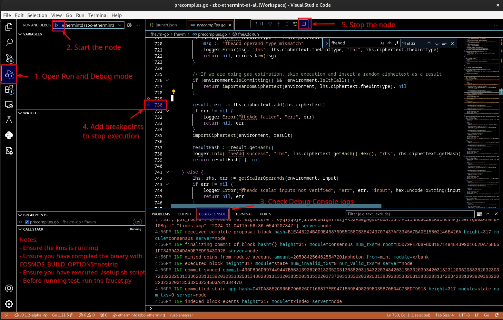

<!--
parent:
  order: false
-->

<div align="center">
  <h1> DEBUG mode </h1>
</div>


## Debug, why?

Running the debugger involves a few steps, but the benefit is huge, being able to trace the execution and stop it anywhere!


## Prepare your setup

1. Install go (1.21.5 for instance)

2. Clone at the same level zbc-go-ethereum and fhevm-go

```
├── zbc-ethermint
├── fhevm-go
├── zbc-go-ethereum
```

3. [OPTIONAL] Open vscode workspace with all the needed repositories

- Select __Add folder to workspace__ and add
  - zbc-ethermint
  - fhevm-go
  - zbc-go-ethereum

## Build ethermintd

1. Update dependency to go-ethereum and fhevm-go

```bash
make prepare-local-build
# output
#FILE: go.mod
#CUSTOM_PATH: ..
#go.mod has been updated
#diff --git a/go.mod b/go.mod
#index 255d36ca..0d966725 100644
#--- a/go.mod
#+++ b/go.mod
#@@ -221,8 +221,8 @@ require (
# replace (
#-       github.com/ethereum/go-ethereum v1.13.5 => github.com/zama-ai/zbc-go-ethereum v0.1.2-alpha
#-       // PLACEHOLDER_FHEVM_GO
#+       github.com/ethereum/go-ethereum v1.13.5 => ../zbc-go-ethereum
#+               github.com/zama-ai/fhevm-go v0.1.2-alpha => ../fhevm-go
```

2. Update dependency to fhevm-go in zbc-go-ethereum: 

NOTE: this step seems optional! The reason could be that go package manager choose for a specific package the  upper go.mod version as reference if they initially both point to the same version. (TO BE CONFIRMED)

3. In fhevm-go, build C api

- check the version you want
- build the tfhe-rs C api


```bash
git checkout v0.1.2-alpha
git submodule update --init --recursive
# Build the C lib.
make build
```

4. Build ethermintd (nostrip for debug mode)

```bash
COSMOS_BUILD_OPTIONS=nostrip make install
# ethermintd binary will be installed in $HOME/go/bin
# Ensure $HOME/go/bin is in your $PATH
# CHeck if ethermintd --version could be run from anywhere
```

## Prepare the node start

1. Set FHEVM_GO_KEYS_DIR

```bash
mkdir -p $HOME/network-fhe-keys
mkdir -p $HOME/kms-fhe-keys
export FHEVM_GO_KEYS_DIR=$HOME/network-fhe-keys
export KMS_KEYS_DIR=$HOME/kms-fhe-keys
```


2. Generate FHE keys

```bash
./scripts/prepare_volumes_from_fhe_tool_docker.sh v0.2.2 $FHEVM_GO_KEYS_DIR $KMS_KEYS_DIR
```

3. Run the kms

```bash
docker run -p 50051:50051 -v $KMS_KEYS_DIR:/usr/src/kms-server/temp ghcr.io/zama-ai/kms:v0.1.2
Server is listening at 0.0.0.0:50051
```


4. Configure the node

```bash
./setup.sh
```

Ethermint node default home is located at ```$HOME/.ethermintd```

If you need to have a fresh start remove this folder and run ./setup.sh again.


## Run the node in debugger mode

1. Check the content of [launch.json](.vscode/launch.json)

- Check the path to ethermintd binary
- Check the path to FHE keys ```FHEVM_GO_KEYS_DIR```
- Check ```KMS_ENDPOINT_ADDR```


2. Go into ```Run and Debug``` section in Vscode (or Ctrl+shift+D/shift+Cmd+D)

Click on __ethermintd(zbc-ethermintd)__





## Execute some tests

1. Run the faucet to give some coins to all of the test accounts of fhevm. 

```bash
./fund_test_adresses.sh
```

Go to [```fhevm```](https://github.com/zama-ai/fhevm)

```bash
cp .env.example .env
npm i
# partial test
npx hardhat test --grep "transfer"
# Compiled 33 Solidity files successfully

#   EncryptedERC20
#     ✔ should transfer tokens between two users (12892ms)
#     ✔ should not transfer tokens between two users (12366ms)

#   Comp
#     ✔ should transfer tokens (7746ms)

#   CompliantERC20
#     ✔ should prevent transfers (55497ms)

#   4 passing (2m)

# full test
npx hardhat test
```
